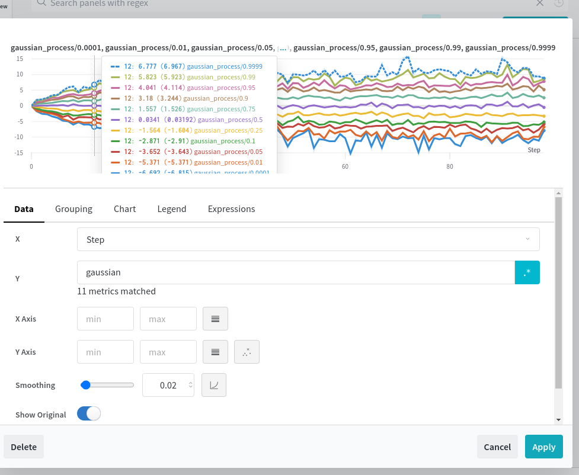

# Wandb histogram over time example

I wanted this:

So I made this repo to do it in wandb, inspired by [this](https://stackoverflow.com/questions/71506186/how-to-get-create-a-histogram-over-time).

Result:

Unfortunately you still have to add a panel manually since wandb doesn't offer a programmatic way to do this. Just click 'edit panel', and you should see the following:

